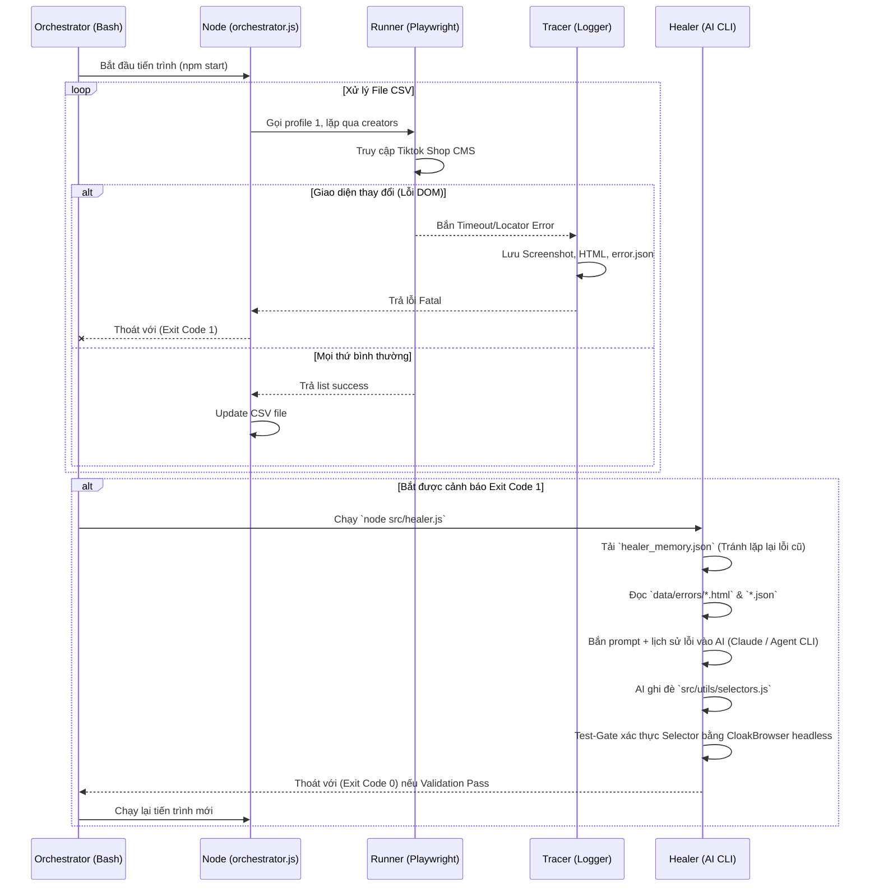

# Kiến trúc hệ thống (System Architecture)

> Hệ thống được chia thành 4 thành phần chính để tách biệt chức năng vận hành (Operations) và chức năng phục hồi (Maintenance).

## 1. Core Modules (4 Trụ cột)

- **🏃 Runner (`src/runner.js`)**: Thực thi nhiệm vụ tự động hóa qua CloakBrowser (phiên bản stealth của Playwright) với Human Preset và Hardware Identity phần cứng độc lập.
- **🔍 Tracer (`src/tracer.js`)**: Ghi chép và chụp lại hiện trường (Context snapshot) khi quá trình Runner bị đứt gãy do Selector lỗi.
- **🧠 Healer (`src/healer.js`)**: Kích hoạt AI để đọc context lỗi, nhận diện DOM hiện hành. Phiên bản Healer 2.0 bao gồm Continuity Memory để tránh lặp lỗi cũ và Test-Gate ẩn để tự động xác thực (Validate) Selector mới trước khi cho phép chạy lại.
- **🔄 Orchestrator (`src/orchestrator.js` & `run.sh`)**: Bash loop điều phối chu trình, cập nhật kết quả vào cơ sở dữ liệu.

## 2. Luồng dữ liệu và Điều khiển (Data Flow)

## 3. Tại sao chọn kiến trúc này?

1. **Hiệu suất (Performance Constraint)**: Playwright chạy trên Node.js cực kỳ nhanh. Nếu để AI (LLM) quyết định và browse DOM trên từng lượt chạy (như AutoGPT hoặc các Web Agent), tốc độ sẽ rất chậm và chi phí cực lớn.
2. **Kinh tế (Cost-Efficiency)**: AI chỉ được kích hoạt (invoke) vào thời điểm giao diện thực sự bị TikTok thay đổi (A/B Test deployment từ bên TikTok), chiếm chưa tới 1% uptime. Toàn bộ 99% thời gian lại chạy bằng Hard-coded Script.
3. **Mô-đun hóa Selector (Modularity)**: `selectors.js` là file duy nhất mô tả giao diện tương tác. Việc gom tất cả selectors vào 1 file JS giúp Healer dễ dàng phân tích và Replace nội dung mà không lo chạm trán vào Core logic điểu khiển bằng `if/else` của Playwright, tránh hỏng syntax dự án.

## 4. Tùy biến (Customization)

Hệ thống được thiết kế linh hoạt với `.env` cho phép setup:
- \`HEALER_COMMAND=npx agent-browser fix\`: Lệnh này có thể đổi thành `claude fix ...` hoặc `cursor ...` đối với bất kỳ extension AI Agent nào bạn muốn triển khai trên Command line của Local Host.
